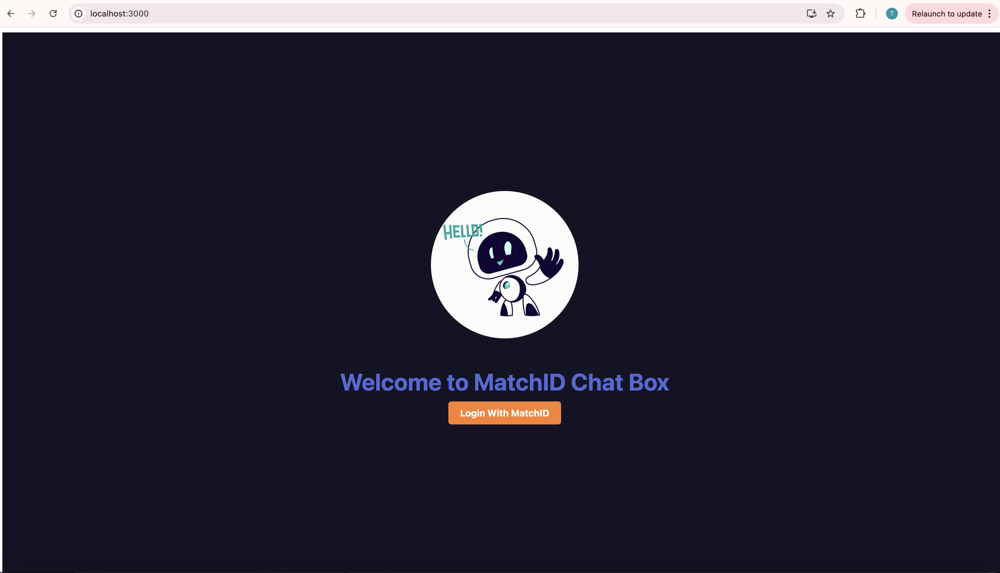
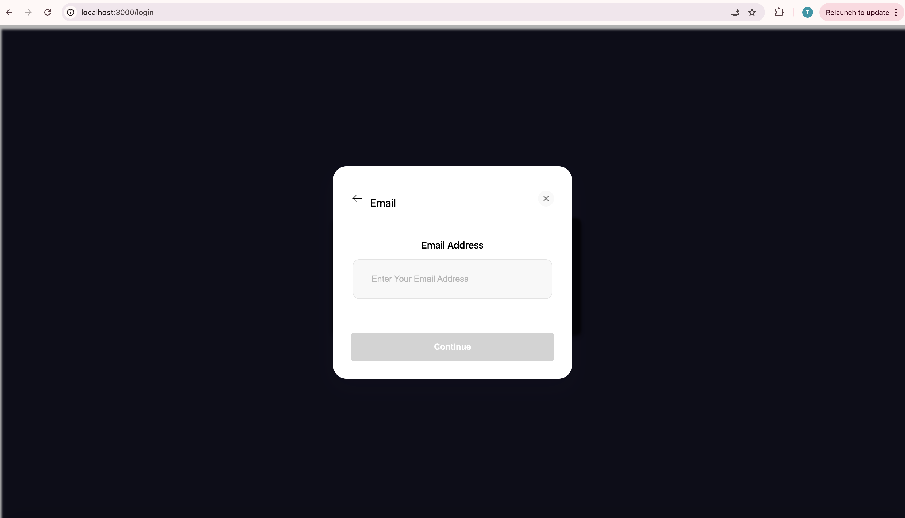
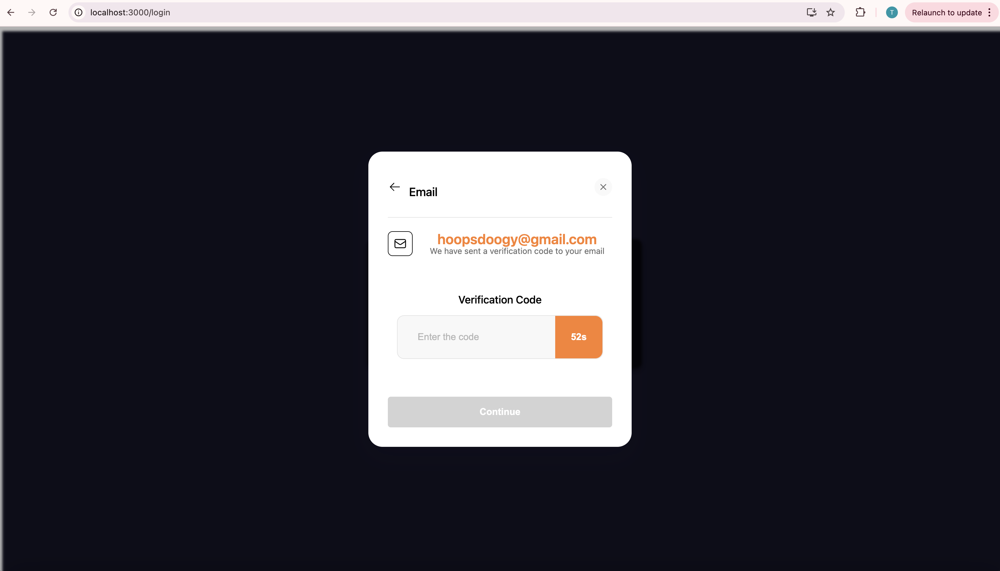
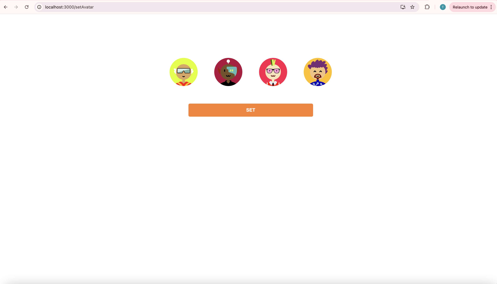
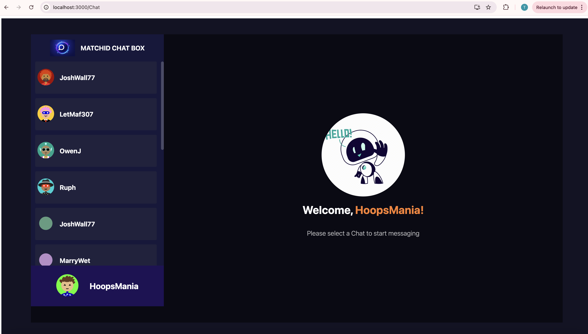
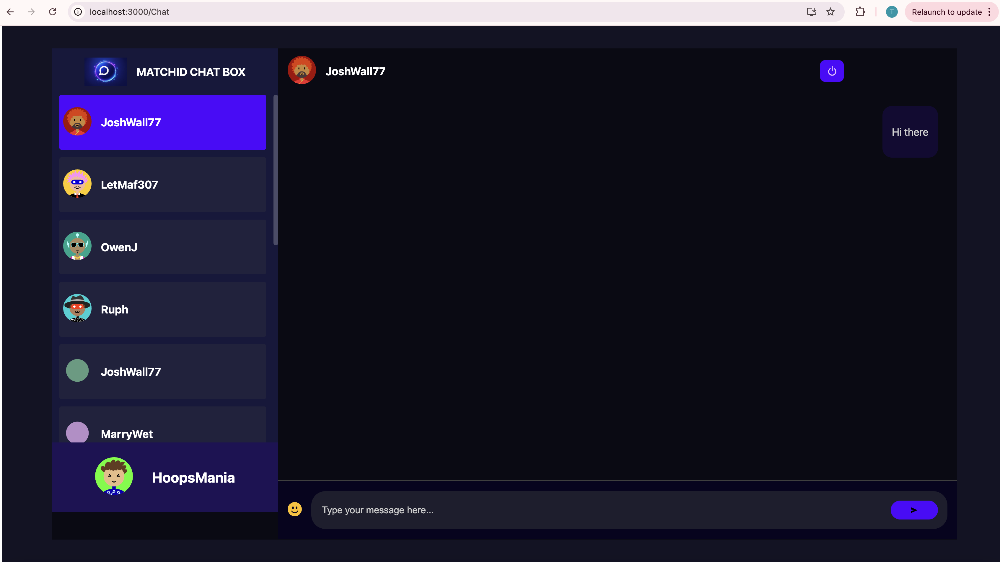

# matchid-sandbox-demo

A demo chat Dapp showing how to integrate MatchID into your web application.

## Requirements

- Node.js v20 or higher

## Setup

1. **Install Front-End Dependencies**

   ```bash
   yarn install inside the front-end folder
   ```

2. **Set your AppID**

   ```bash
   Fill in your AppID in the .env file inside the front-end folder
   ```

3. **Start your Front-End**  
   
   ```bash
   npm run start
   ```

4. **Set your mongodb for saving chats**

   ```bash
   Fill in your mongodb in the .env file inside the back-end folder
   ```

5. **Install Back-End Dependencies**  
   
   ```bash
   yarn install inside the back-end folder
   ```

6. **Start your Back-End**  
   
   ```bash
   npm run start
   ```

7. **Explore and enjoy your Dapp!**

## Demo Screenshots






